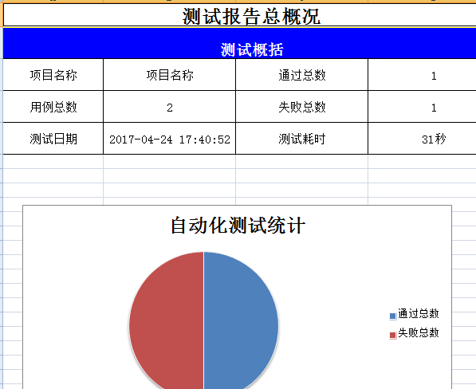
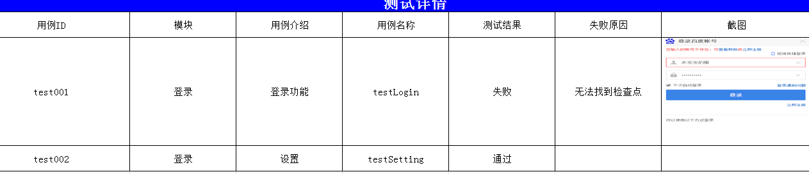

# 说明
之前分享过自己写的appium框架，有很多待优化的地方，先从selenium开始优化

# 功能
* yaml维护用例
* 支持多检查点
* excel记录报告，失败有截图展示
* 本地记录日志
* 参数化测试用例管理


# 用法

**下载项目:**

```
git clone git@github.com:Louis-me/selenium.git
```

**配置openurl.yaml**

```
openurl: http://www....com/login
```

**配置用例yaml**


```
testinfo: 
    - id: 001
      moudle: mok模块
      intr: 个人
testcase:
    - element_info: //*[@id="login"]/div[1]/div[2]/form/div[1]/input
      find_type: by_xpath
      operate_type: send_keys
      text: test
    - element_info: //*[@id="login"]/div[1]/div[2]/form/div[2]/input
      find_type: by_xpath
      operate_type: send_keys
      text: 123456
    - element_info: //*[@id="login"]/div[1]/div[2]/form/button[1]
      find_type: by_xpath
      operate_type: click
check:
    - element_info: //*[@id="home"]/a
      find_type: by_xpath
    - element_info: //*[@id="setting111"]/a
      find_type: by_xpath

```

**编写测试用例**

基本上是直接复制

```
PATH = lambda p: os.path.abspath(
    os.path.join(os.path.dirname(__file__), p)
)
from testRunner.runnerBase import TestInterfaceCase
class testSetting(TestInterfaceCase):
    def setUp(self, methodName=''):
        super(testSetting, self).setUp()
        self.bc = webCase.WebCaseBase(driver=self.driver, casename="testSetting")
    def tearDown(self):
        self.driver.quit()
        pass
    def test_setting(self):
        self.bc.execCase(PATH("../yaml/setting.yaml"))
```


**命名行运行:**

```
pyhton testRunner/runner.py
```

**测试报告**






