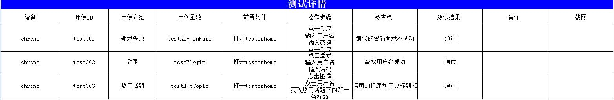

# 项目名及简介
* python3 + selenium自动化测试

# 介绍
* unittest参数化
* PageObject分层管理
* 用例编写基于yaml配置多关键字驱动
* 自动生成excel测试报告


## 命令运行

```
python runner.py
```
- 或者修改start.test.bat中的路径后，直接点击运行


# 结果展示

**日志目录**

- 文件夹：chrome_XXXXX，包含截图

```
2018-04-29 23:28:09,357  - INFO - ----  test001_登录失败_div.container>ul>li:nth-child(2)_css_click_         ----
2018-04-29 23:28:09,970  - INFO - ----  test001_登录失败_input-lg_class_name_send_keys_lose1        ----
2018-04-29 23:28:10,066  - INFO - ----  test001_登录失败_user_password_id_send_keys_1231231232        ----
2018-04-29 23:28:10,187  - INFO - ----  test001_登录失败_div.form-actions_css_click_         ----
2018-04-29 23:28:10,784  - INFO - ----  test001_登录失败_div.alert-warning_css_ _         ----
2018-04-29 23:28:10,785  - INFO - [CheckPoint_1]: testALoginFail_ : OK
2018-04-29 23:28:36,116  - INFO - ----  test001_登录_div.container>ul>li:nth-child(2)_css_click_         ----
2018-04-29 23:29:41,881  - INFO - ----  test001_登录_input-lg_class_name_send_keys_lose1        ----
2018-04-29 23:30:16,331  - INFO - ----  test001_登录_user_password_id_send_keys_1231231232        ----
2018-04-29 23:30:16,433  - INFO - ----  test001_登录_div.form-actions_css_click_         ----
2018-04-29 23:31:02,425  - INFO - [CheckPoint_2]: testBLogin_==请检查dropdown-avatar==: NG
```
- 实时日志

```buildoutcfg

testALoginFail (TestCase.HomeTest.HomeTest) ... ==操作步骤：div.container>ul>li:nth-child(2)_css_click_ ==
==操作步骤：input-lg_class_name_send_keys_lose1==
==操作步骤：user_password_id_send_keys_1231231232==
==操作步骤：div.form-actions_css_click_ ==
==操作步骤：div.alert-warning_css_ _ ==
==用例_登录失败检查点成功==
ok
testBLogin (TestCase.HomeTest.HomeTest) ... ==操作步骤：div.container>ul>li:nth-child(2)_css_click_ ==
==操作步骤：input-lg_class_name_send_keys_lose==
==操作步骤：user_password_id_send_keys_XXX==
==操作步骤：div.form-actions_css_click_ ==
==操作步骤：dropdown-avatar_class_name_click_ ==
==操作步骤：//ul[@class='dropdown-menu']/li/a[contains(text(),'lose')]_xpath_ _ ==
==用例_登录检查点成功==
[{'caseName': 'testALoginFail', 'step': '点击登录\n输入用户名\n输入密码\n点击登录\n', 'info': '打开testerhome', 'title': '登录失败', 'checkStep': '错误的密码登录不成功\n', 'id': 'test001', 'msg': '', 'name': 'chrome', 'result': '通过'}]
ok
testHotTopic (TestCase.MyTest.MyTest) ... ==操作步骤：div.container>ul>li:nth-child(2)_css_click_ ==
==操作步骤：input-lg_class_name_send_keys_lose==
==操作步骤：user_password_id_send_keys_xxxx==
==操作步骤：div.form-actions_css_click_ ==
==操作步骤：dropdown-avatar_class_name_click_ ==
==操作步骤：dropdown-avatar_class_name_click_ ==
==操作步骤：//ul[@class='dropdown-menu']/li/a_xpath_click_ ==
==操作步骤：//ul[@class="list-group"]/li[1]/div/a[2]_xpath_get_text_ ==
==操作步骤：ul.list-group > li:nth-child(1) > div.title > a:nth-child(2)_css_click_ ==
==操作步骤：/html/head/title_xpath_get_text_ ==
==用例_热门话题检查点成功==
```


**测试报告**




# 其他 
* [使用实例](use.md)
* [changelog](CHANGELOG.md)


